% Secretary of State Run Book
% Colorado Risk Limiting Audit Tool v1.0.0 alpha-2
% 2017

## Introduction

This Run Book guides State election administrators 
who
will be implementing a Risk Limiting Audit (RLA). There is a separate
book for County election administrators.

The RLA Tool, developed by Free & Fair for the Colorado Department of
State for use in elections in November 2017 and later, supports
Risk-Limiting Audits as required by Colorado statute and as described
in the
[Colorado Secretary of State's Rule 25](http://www.sos.state.co.us/pubs/rule_making/CurrentRules/8CCR1505-1/ElectionRules.pdf) for
elections.

The RLA Tool helps the Colorado Secretary of State fulfill the
requirements of Rule 25.2.2 and Rule 25.2.3.  Using the RLA Tool,
Secretary of State can enter the risk limit, the publicly-generated
random seed, and the contests that drive the audit process. As
Counties upload ballot manifests and CVR files, the RLA Tool allows
the Secretary of State to monitor progress. The Secretary of State can
use the tool to identify contests that should go to a full hand
count. The RLA Tool performs the calculations required by Rule 25,
such as choosing random samples of ballots for audit and determining
actual risk levels. While audits are ongoing, the Secretary of State
can monitor the progress of the individual County audit boards.

The RLA Tool also exports reports and files for use in the Audit
Center, a website required by Rule 25 to disseminate audit-related
information to the public.

This version of the RLA Tool requires that the contests driving the
audit round sizes and risk level calculations must be single-County
contests.

This version of the RLA Tool requires Cast Vote Record and Ballot
Manifest files in the format exported from the Dominion Democracy
Suite. In order to achieve transparency of the audit while respecting
voter privacy, Column F (the "CountingGroup") column must be deleted from 
the Cast Vote Record files.
 
### Launching and Logging In

Department of State users must log in to the RLA Tool by pointing
their browser to the URL designated by the Department of State. 
County users can use the same URL.

Successful entry of username and password will lead to 
a two-factor authentication grid challenge.

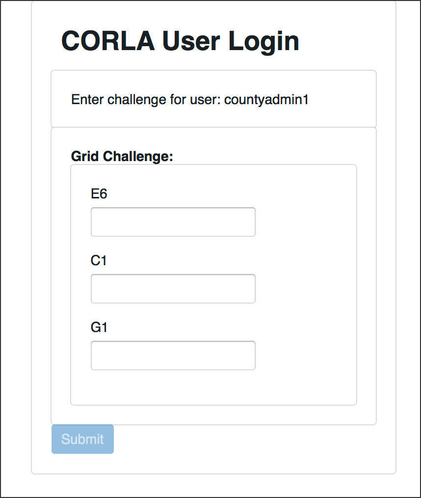

The RLA Tool will direct users to the Department of State home
page. At the start of the audit process, this page will contain no
information. 

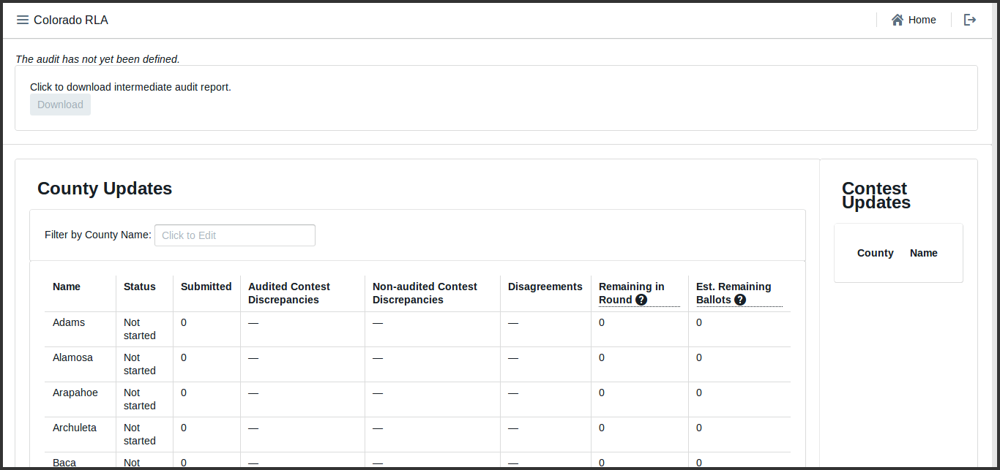

### Navigation

In the upper left corner of every page the Secretary of State site has a menu that
can be used to navigate to the Home Page, the Counties Page, the Contests page or the 
Define Audit wizard. Click on the
navigation icon to bring up the navigation menu.

In the upper right corner of each page is a button to return to 
the Home Page 

and a button to log out of the system 
altogether.

## Audit Definition

To define the audit -- to specify the risk limit and other choices -- 
use the navigation menu to navigate  to the Define Audit section. 
On this page, enter the date of the election, the type of election, 
the date of the public meeting to choose the random seed and the risk limit.
Note that once these selections are saved they cannot be modified.

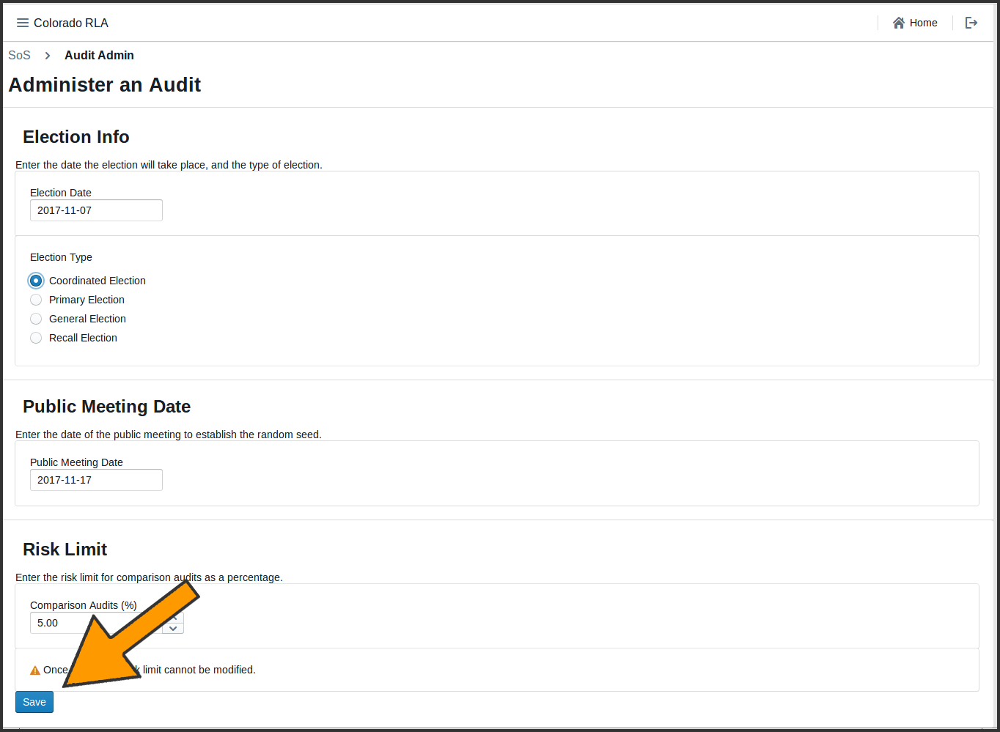

Clicking the "Save" button brings up a page summarizing the 
choices made on the previous screen. 

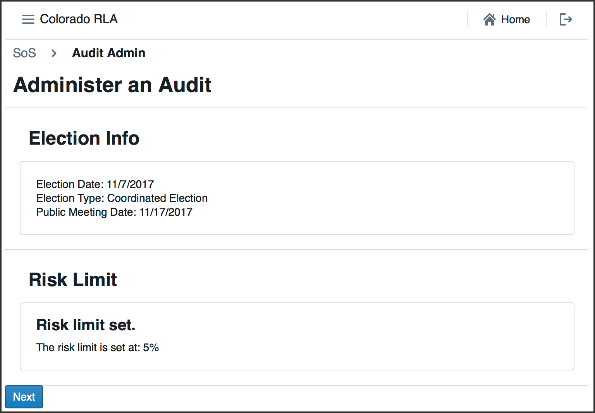

Clicking "Next" brings up the contest selection screen. This step cannot be completed until 
after the Counties have uploaded the contest data, i.e., the ballot manifest and cast vote record files.

### Monitoring County Uploads

To monitor the status of the County uploads, navigate to the Home Page.
The County Update table Status column allows the Secretary of State to see the status of each individual 
County's file uploads.

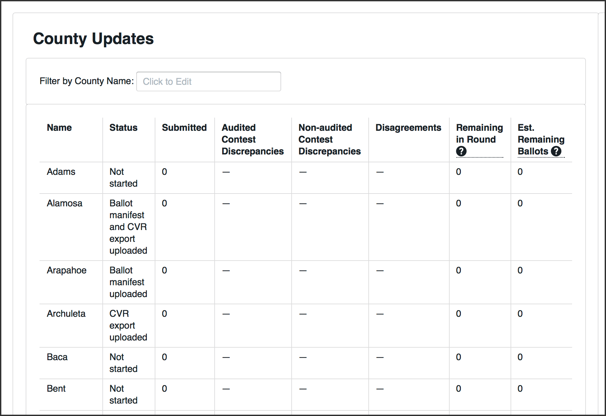

When the Counties have uploaded the necessary files, the Secretary of State
can continue defining the audit using the dropdown menu on the upper left.

### Selecting Contests

The Secretary of State will then select the contests that will drive
the sample size and stop/go decisions for each round.  Rule 25
calls these "contests to be audited". Click on the “County” or “Contest” 
column name to sort by that column’s data. To reverse sort, click on the 
column again. 

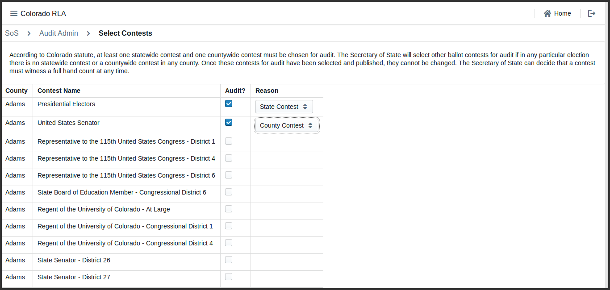

Calculations of audit round sizes and risk levels are based
on single County contests. Note that in the current version
of the RLA Tool, all contests are considered to be single-county contests.
For example, in the context of the audit, the contest for votes for US Senator in Boulder County 
has nothing to do with the contest for US Senator in Pueblo County 
(even though in the real world the winner of the US Senate race is determined by combining vote totals from all Counties).

### The Random Seed

The Secretary of State enters the random seed determined at the public meeting. Note that once the 
"Save & Next" button is clicked, the random seed cannot be changed.

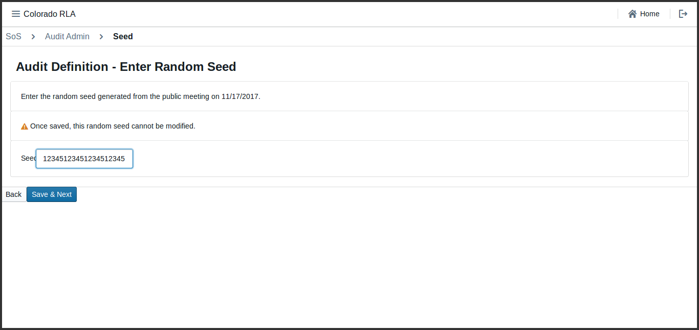

If the random seed is not at least 20 digits long, the system shows a
red error message. User will have to click the "Back" button and try
again.

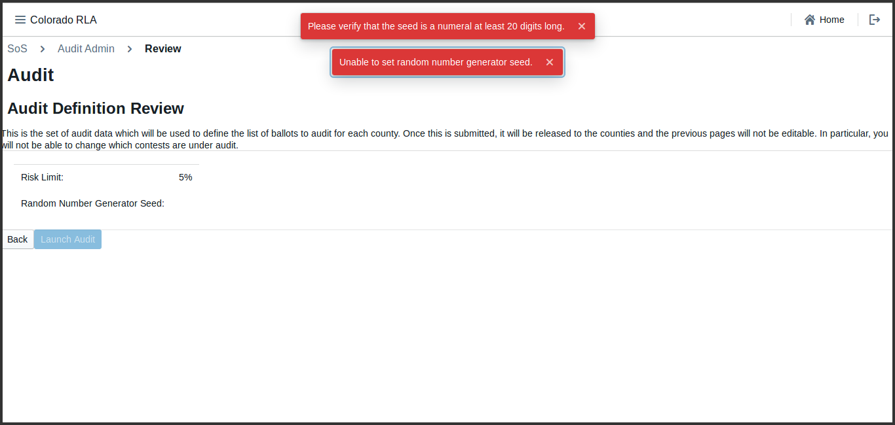

Once the random seed has been successfully entered, the Secretary of State can launch the
audit by clicking the "Launch Audit" button.

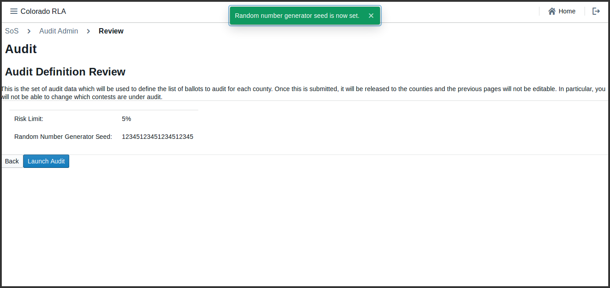

## Auditing

### Audit Rounds

The audit is organized into rounds. The first round begins
when the Secretary of State launches the audit. 
The RLA Tool gives lists each County a list of ballot cards to be 
reviewed by the County Audit Board. As the Audit Boards 
proceed, the Secretary of State can monitor progress. 

When each County Audit Board has reviewed all assigned ballot cards and
certified its review, the Secretary of State will have the option to begin the next round.

Once the audit is launched, the first round of the audit begins. In
each round, the tool shows each County a list of ballot cards to be
reviewed. As the County Audit Boards review ballot cards and enter
interpretations, the Secretary of State can see the number of ballot
cards reviewed so far, the number of ballot cards with discrepancies
(between audit board interpretations and the CVR file), the number of
ballot cards on which the audit board disagreed, and the number of
ballot cards yet to be reviewed in the current round in the County
Update table.

### Monitoring County Audit Activity

The RLA Tool permits the Secretary of State to see the progress of
audit for selected contests and the estimated number of ballot cards
remaining to be audited to meet the risk limit.

In this example, contests have been chosen for audit in Alamosa and Arapahoe 
Counties. These contests are listed in the Contest Update table.

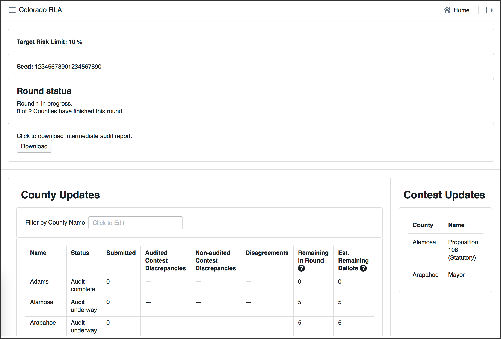

#### County Update Table ####

The County Update Table has several columns.

	 *  Status - The Status of the County's audit 
	 *  Submitted - The number of ballot cards already reviewed by the Audit Board
	 *  Audited Contest Discrepancies - the number of cast vote records whose corresponding ballot card either could not be found, or contains at least one race selected for audit for which the Audit Board's interpretation differs from the cast vote record
	 *  Non-audited Contest Discrepancies - the number of cast vote records whose corresponding ballot card either could not be found, or contains at least one race not selected for audit for which the Audit Board's interpretation differs from the cast vote record 
	*  Disagreements - the number of ballot cards on which the Audit Board could not come to consensus in at least one race
	*  Remaining in Round - the number of ballot cards remaining for the Audit Board to review in order to complete the current round
	*  Est. Remaining Ballots - the estimated size of the statistical random sequence of cast vote records that will be required to finish the audit (with duplicates) minus the size of the longest prefix of that sequence consisting of cast vote records whose corresponding ballot cards have already been reviewed by the Audit Board.
	
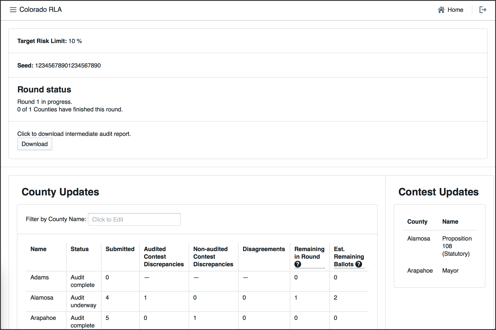

	 
The County Update Table can be filtered by County name.

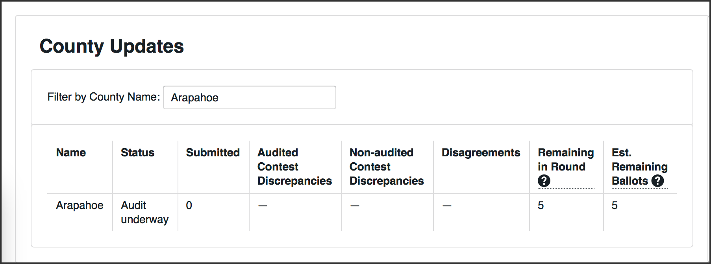

#### Launching a New Round ####

At the end of each round, if the 
Risk Limit has not been met yet, the Secretary of State can launch the next
round by clicking the "Start Round" button. This button will work only
if each and every County Audit Board has not only finished the audit
round, but also signed off on the audit round.

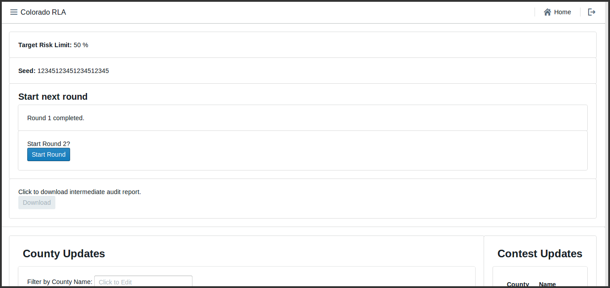

### Ending the Audit

Once the risk limit is met and the final round concludes, as shown on the State home page.

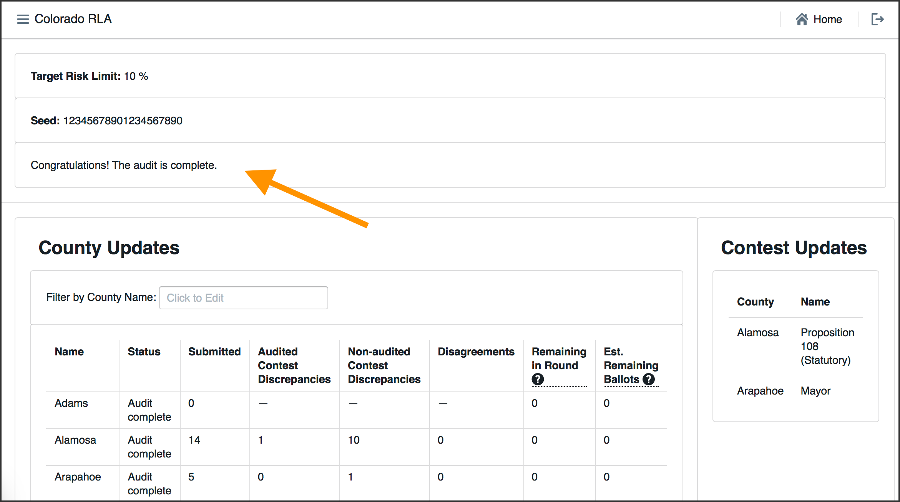

<!-- ## Hand Counts 
-->

<!--- ## Exports
--->

